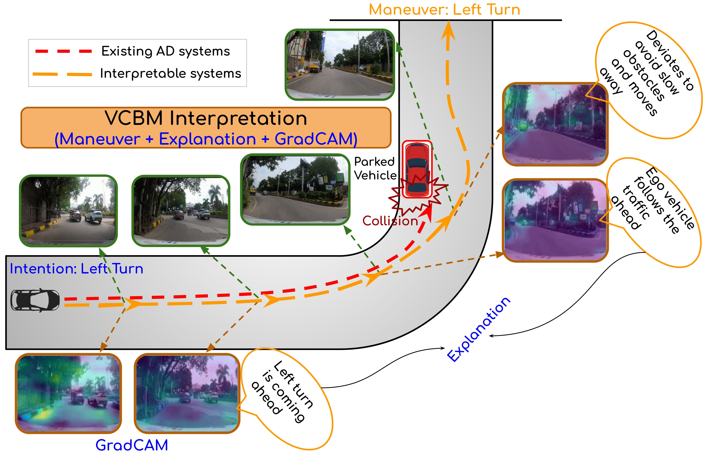

# Towards Safer and Understandable Driver Intention Prediction 🚗🛡
## ICCV 2025

Mukilan Karuppasamy, Shankar Gangisetty, Shyam Nandan Rai, Carlo Masone, C.V. Jawahar


## Table of Contents


- [Introduction](#introduction)
- [Installation](#installation)

## Introduction

<p align="center">
  
</p>   

---


Autonomous driving (AD) systems increasingly rely on deep learning, but understanding why they make decisions remains a challenge. To address this, we introduce Driver Intent Prediction (DIP) — the task of anticipating driver maneuvers before they happen, with a focus on **interpretability**.

We present DAAD-X, a new multimodal, egocentric video dataset offering high-level, hierarchical textual explanations grounded in both driver eye-gaze and vehicle perspective.

To model this, we propose the **Video Concept Bottleneck Model (VCBM)** — a framework that inherently generates spatio-temporally coherent explanations **without post-hoc methods**. Through extensive experiments, we show that transformer-based models offer superior interpretability over CNNs. We also introduce a **multilabel t-SNE visualization** to highlight the causal structure among explanations.


## Installation:wrench:

### Prerequisites
- Python >= 3.8
- CUDA >= 11.0 (for GPU support)
- 16GB+ RAM recommended

### Installation for SlowFAST/MViTv2 models;

Our conda environment is identical to [SlowFAST](https://github.com/facebookresearch/SlowFast.git), we recommend following their installation instructions.

### Installation for I3D and DINO models;

```shell
git clone https://github.com/Mukil07/DIP-Explainability.git
cd models
conda env create -f environment.yml

export PYTHONPATH="./:$PYTHONPATH"
```

Additionally have to install transformers library and Pytorch Video, 
```shell

git clone https://github.com/facebookresearch/pytorchvideo.git
pip install -e .
```
---
## DAAD-X Dataset 📖:

The DAADX Dataset is derived from DAAD dataset (https://cvit.iiit.ac.in/research/projects/cvit-projects/daad#dataset), which contains all the captured videos for the Driver Intention Prediction task.
We are introducing the first video based explanations dataset for driver intention prediction task. This will be help in further the research interms of making an explainable Autonomous Driving or ADAS System.

DAAD-X contains explanations for each maneuver instance, these explanations corresponds to both Driver's perspective (Gaze explanations) and Car's perspective (Ego Explanations). This will help in understanding why
the model predicts the particular maneuver with high level human understandable explanations. 

The annotations folder contains the following files:
```shell
total.csv -- all the annotations (1568 (all views with gaze) + 158 (all views wihtout gaze))
train.csv -- 70% split (1097 (all views with gaze))
val.csv -- 20% split (313 (all views with gaze))
test.csv -- 10% split (158 (all views with gaze))
time.csv -- during maneuver (start,end) time stamps 
```
**Note:** Here few videos (158 videos) from total video are removed due to discrepancies in the time sync between the gaze videos and view videos. 
This ideally corresponds to 1568 total videos for train/test/val split. 

The train/val/test csv contains multiple rows, where each row corresponds to the particular video capture. The values in each row contains comma separated entires. 
They are `video id, manuever class (7 classes), gaze explanations (15 classes), one hot encoded ego explanations (17 entries)`. 

The maneuver class mapping is as follows:
```shell
0: Straight
1: Stop
2: Left Turn
3: Left Lane Change
4: Right Turn
5: Right Lane Change
6: U Turn
```

The gaze explanation class mapping is as follows:
```shell
0: The Gaze is mostly towards the forward direction
1: The Gaze is mostly towards the traffic ahead
2: The Gaze is towards the action inducing objects
3: The Gaze is towards the right side mirror
4: The Gaze is on the left side and slowly changes to right side 
5: The Gaze is mostly towards the front right side 
6: The Gaze is initially towards left side and then moves to the right side 
7: The Gaze is mostly towards the right side 
8: The Gaze is mostly towards the right side mirror
9: The Gaze is towards the front right side
10: The Gaze is mostly towards the front left side 
11: The Gaze is initially towards the right side and then moves to left side
12: The Gaze is mostly to the left side 
13: The Gaze is mostly towards the left side mirror
14: The Gaze is towards the front left side
```
The order of explanations in the one hot encoded ego explanations vector is as follows:
```shell
0: The Ego vehicle is nearing an intersection and theres no traffic light
1: The Ego vehicle is nearing an intersection and traffic light is green
2: The Ego vehicle follows the traffic ahead 
3: The road is clear ahead
4: The Ego vehicle deviates to avoid slow vehicle/obstacles and moves straight
5: The vehicle ahead slows down
6: Pedestrian or Vehicle cutting in the path ahead
7: The Ego vehicle is nearing an intersection and traffic light is red
8: The Ego vehicle joins the traffic moving to the right
9: A right turn coming ahead
10: The traffic moves from the left to right side at the intersection 
11: The traffic moves from the right to left side at the intersection 
12: The road is clear ahead on the right lane
13: No Speeding vehicle on the right lane is coming from the rear right side
14: A left turn coming ahead
15: The road is clear ahead on the left lane
16: No Speeding vehicle on the left lane is coming from the rear left side
```

**Note:** The video name is common across all the video folders, i.e. lets say 2b69bf02-f20a-4ea4-8100-aeac205c6e17.mp4 will be available in front, rear, right, left, driver and ariagaze folders. 
They are time synced videos captured at the particular manuever. 


Follow the steps below to recreate DAAD-X using the data curation pipeline proposed in the paper. You'll need to download the [DAAD-X dataset](please paste link here).

Extract the DAADX.tar file to get videos folders based on views (front, right etc) with its corresponding videos. 
Copy all the videos folder and annotation folder inside a folder named "data" in the root directory. 

**-** Be sure your DAAD-X data directory is structured in the following way
```
data
├── front 
│    ├── 2b69bf02-f20a-4ea4-8100-aeac205c6e17
│    ├── 1ff35b67-5gaa-35a4-3250-aeac205c0613.mp4
│      ...
├── rear
│    ├── 2b69bf02-f20a-4ea4-8100-aeac205c6e17.mp4
│    ├── 1ff35b67-5gaa-35a4-3250-aeac205c0613.mp4
│      ...
├── right
├── left
├── driver
├── ariagaze
├── annotations
    ├── train.csv
    ├── val.csv
    ├── test.csv
    ├── time.csv
```
